

<a href="https://github.com/mohamedismail37/Driving-Vehicle-Licenses-Department" rel="Title">
  
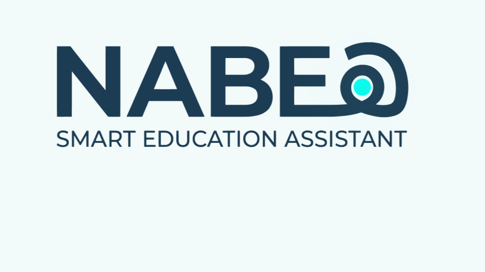
</a>

<h3 align="center"> NABEH Logo </h3>

# NABEH - نبيه

### About The Project
> A complete system **integrated with AI** that **enhances** the teacher and learner experience and aims to raise the level and efficiency of distance education and solve the problems faced by students and teachers.

---
## Table of Contents

- [Project Description](#project-description)
  - [Overview](#overview)
  - [Objectives](#objectives)
  - [Built With](#built-with)
- [Main Features & ScreenShots](#main-features)
  - [Full System](#Full-System)
  - [StartUp/Login/SignUp](#StartUP-Login-SignUP)
  - [Teacher Dashboard](#Teacher-Dashboard)
  - [Course Management & Creation](#Course-Management-&-Creation)
  - [Quality Education](#Quality-Education)
  - [Sessions & Quizzes](#Sessions-&-Quizzes)
  - [Pricing and Subscription](#Pricing-and-Subscription)
  - [Face Direction Detection AI Model](#AI-Model)
- [Architecture & Database Design](#architecture--database-design)
- [Technical Highlights](#Technical-Highlights)
- [File Structure](#file-structure)
- [Future Enhancements](#future-enhancements)
- [Contributers](#Contributers)

## Overview

NABEH is an AI-powered Learning Management System (LMS) designed to improve the online education experience for both students and instructors. The platform combines course management, online assessments, live sessions, and artificial intelligence tools in a single integrated solution.

NABEH aims to address common challenges in remote learning, such as fragmented educational tools, limited student engagement, and academic integrity concerns. By leveraging AI technologies, the platform provides intelligent assistance for instructors, personalized guidance for students, and advanced analytics to support data-driven educational decisions.

The current MVP includes AI-powered attention detection, automated exam generation, performance analytics, online course management, and personalized study recommendations.

## Objectives

* Provide a unified platform for online learning, assessments, assignments, and live sessions.
* Enhance student engagement and attention during lectures and examinations.
* Assist instructors in generating quizzes and exams from educational materials using AI.
* Deliver comprehensive performance analytics to help educators monitor student progress.
* Offer personalized study recommendations tailored to each student's academic needs.
* Reduce dependency on multiple disconnected educational tools and platforms.
* Improve the overall quality, efficiency, and accessibility of remote education.

## Built With

### Backend
* C#
* .NET Framework
* RESTful APIs
* Entity Framework Core
* SQL Server

### Frontend
* HTML5
* CSS3
* JavaScript

### Mobile Development
* Flutter

### AI & Machine Learning
* Python
* Computer Vision
* AI Agents

### Tools & Collaboration
* Git
* GitHub
* Figma

---
## Main Features

#### Full System:
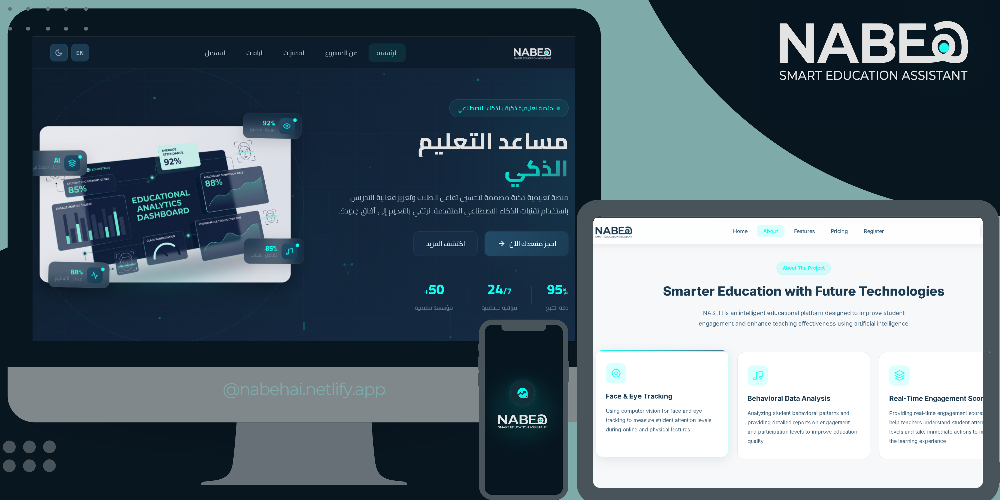

#### StartUp/Login/SignUp:
| StartUP Pages | Login/SignUP |
|---------------|--------------|
| 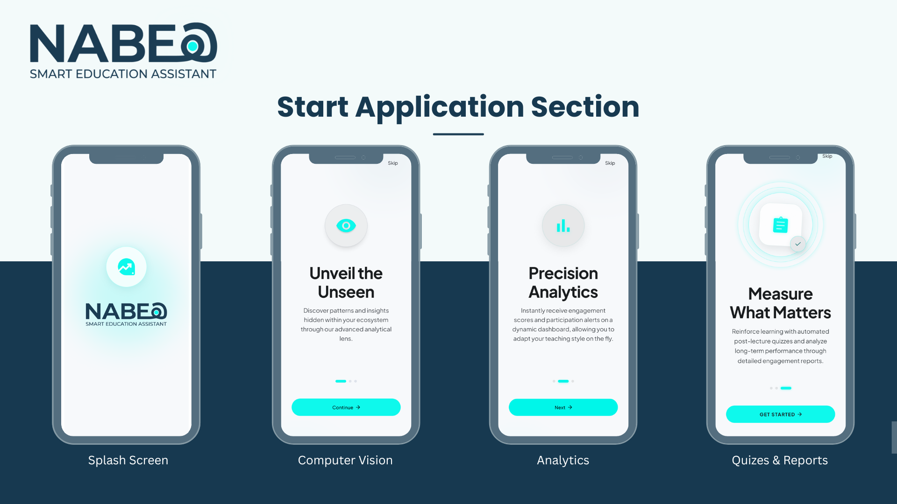 | 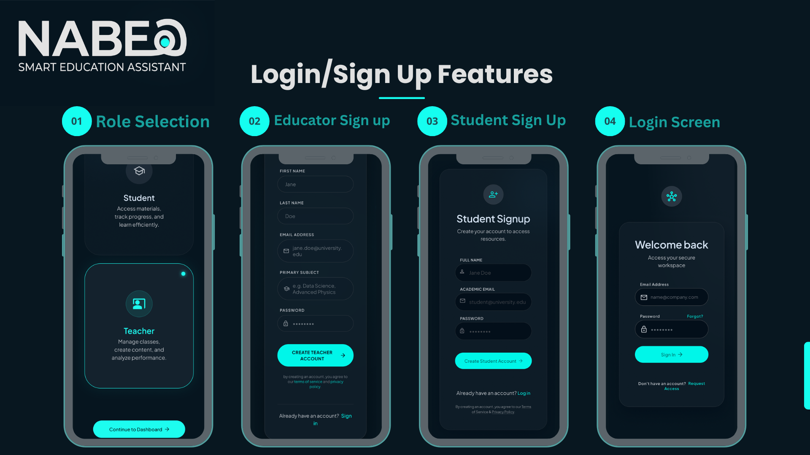 | 

#### Teacher Dashboard:
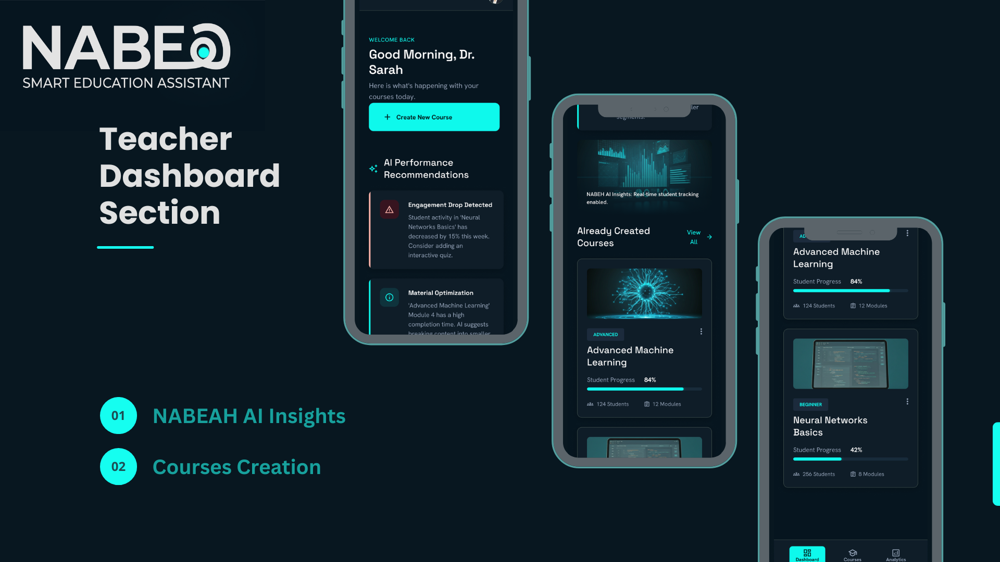

#### Course Management & Creation:
| Course Creation | Course Management |
|-----------------|-------------------|
| 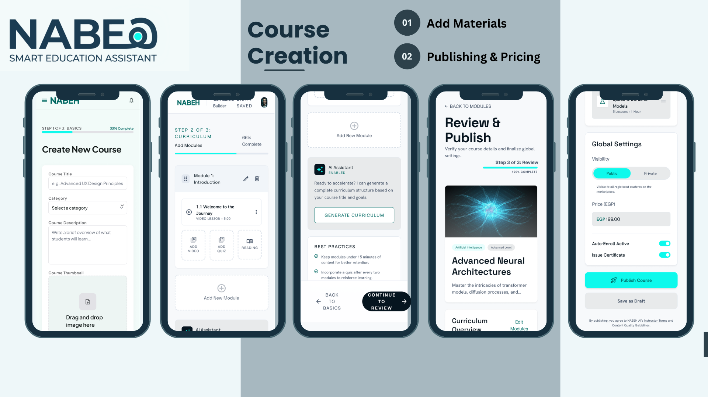 | 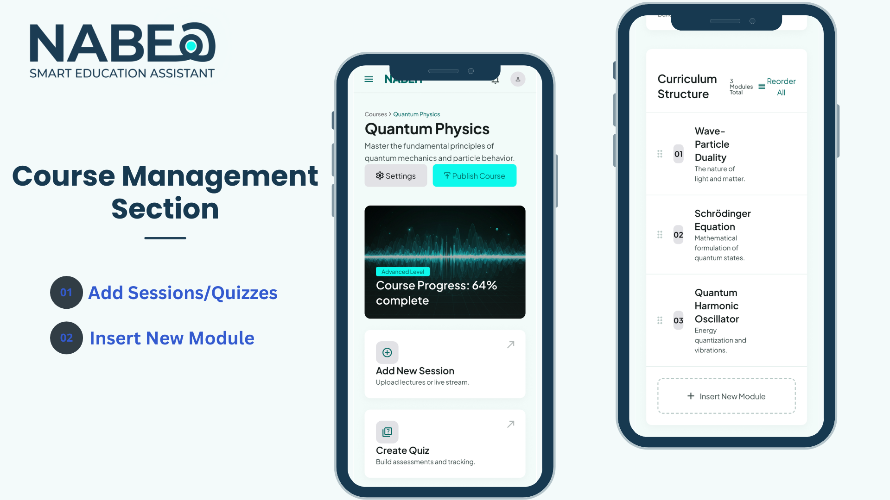 | 

#### Quality Education:
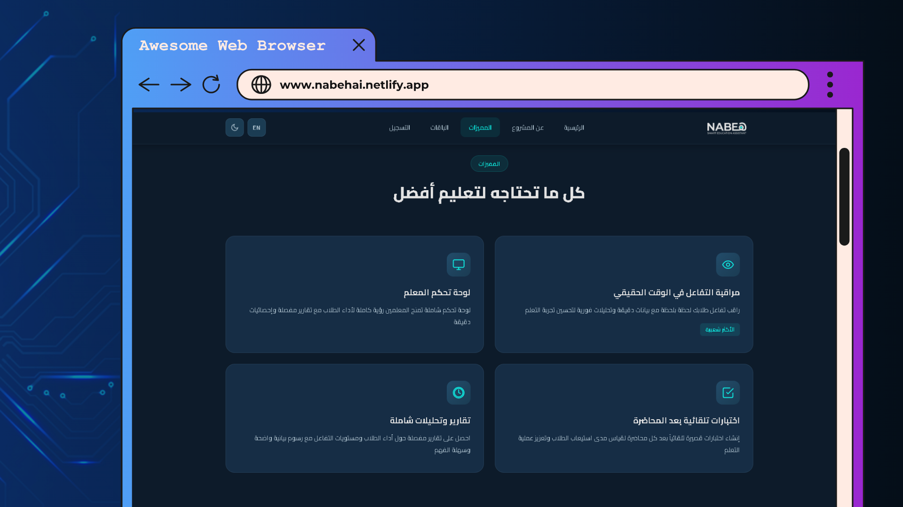

#### Sessions & Quizzes:
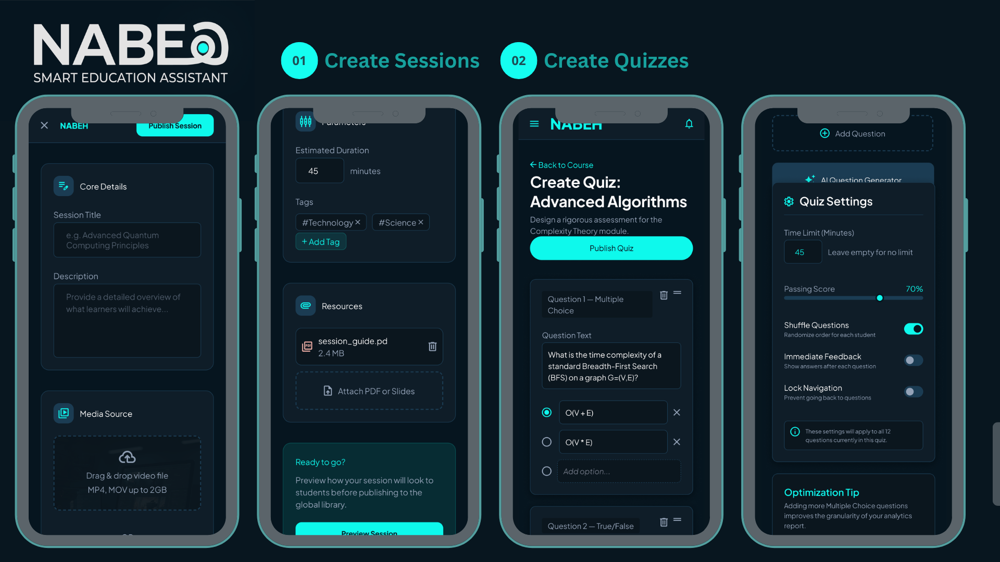

#### Pricing and Subscription
| Pricing Plans | Institutions Subscription Method |
|---------------|----------------------------------|
| 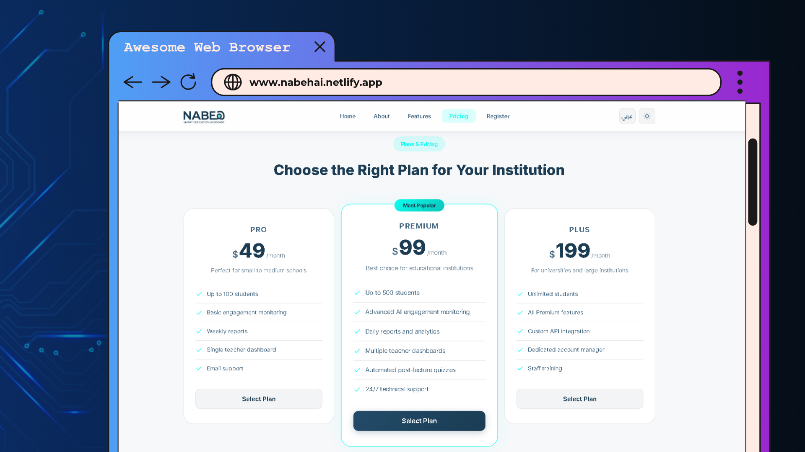 | 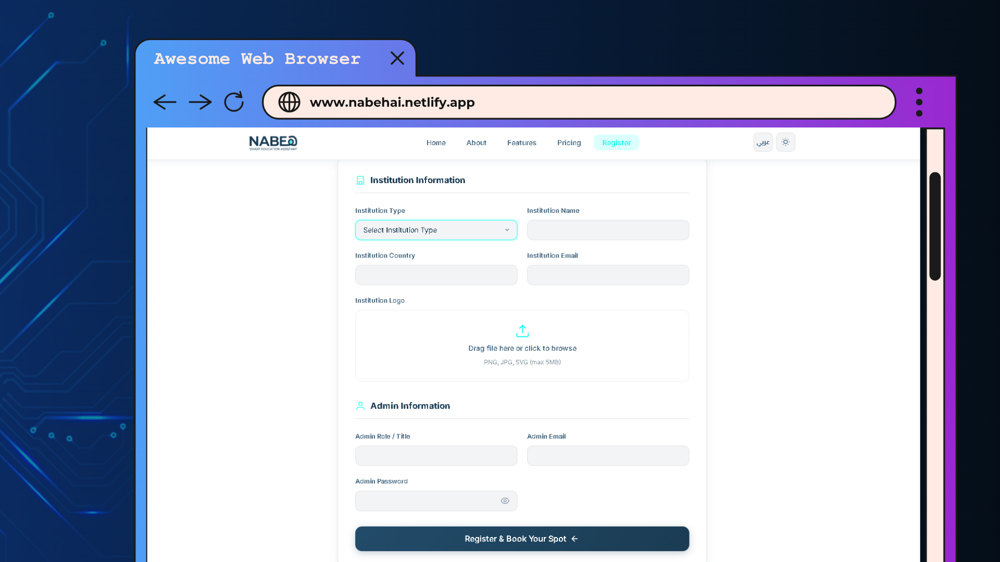 | 

#### AI Model:
<video src="mobile/NabehV.mp4" controls></video>

### Screenshots
You can place all screenshots inside a `/assets` folder

---

### Database Design
- SQL Server database with **19 normalized tables**
- Proper use of:
  - Primary & Foreign Keys
  - NOT NULL & NULL constraints
  - Relationships between entities
- Designed following **database normal forms (1NF → 3NF)**

### Database Schema
📄 [Project Documentation](Backend/db_relationSchema.pdf)

---
## Technical Highlights
- **Full CRUD Operations:** Implemented for all core entities with proper validation and error handling.  
- **Reusable Components:** Custom controls for repeated UI patterns, such as PersonCardWithFilters.  
- **Scalable & Extensible:** Designed to allow adding new features or tables without major refactoring.

---

## Future Enhancements

- [ ] Add **Deployment and Setup (Installation)** section
- [x] ~~Provide a deeper explanation of the **Database** with photos~~
- [ ] Create a **video explaining the program**

---

## Contributers

| Field   | Details |
|---------|---------|
| Name    | Mohamed Ismail |
| Email   | mohamedismailfh@gmail.com |
| LinkedIn| linkedin.com/in/mohamed-ismail-fh |
| GitHub  | https://github.com/mohamedismail37 |

| Field   | Details |
|---------|---------|
| Name    | Yusuf Harby |
| Email   | youssef.sorur789@gmail.com |
| LinkedIn| https://www.linkedin.com/in/yusuf-harby |
| GitHub  | https://github.com/Yusuf-Harby |

| Field   | Details |
|---------|---------|
| Name    | Sherif Elgendy |
| Email   | sherifelgendy2004@gmail.com |
| LinkedIn| https://www.linkedin.com/in/sherifelgendy04/ |
| GitHub  | https://github.com/Sherifelgendy2027 |

| Field   | Details |
|---------|---------|
| Name    | Youssef Ibrahim |
| Email   | youssefibrahim.ai@gmail.com |
| LinkedIn| https://www.linkedin.com/in/youssefibrahimai/ |
| GitHub  | https://github.com/youssefibrahim258 |

| Field   | Details |
|---------|---------|
| Name    | Abdelrahman Samy |
| Email   | as0144549@gmail.com |
| LinkedIn| https://www.linkedin.com/in/abdelrahman-sami-866886248 |
| GitHub  | https://github.com/abdelrahman-abozarifa04 |
